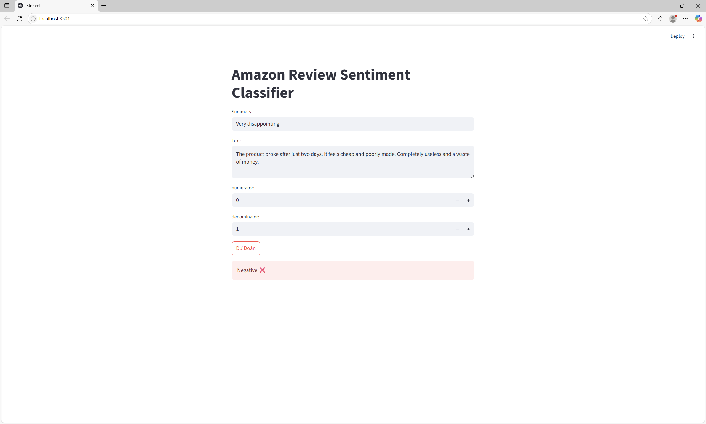

# 📦 Amazon Product Review Sentiment Analysis

**End-to-End Machine Learning Project** for classifying Amazon product reviews as **Positive** or **Negative**.

This project demonstrates real-world skills in:
- Data Preprocessing & Feature Engineering
- Natural Language Processing (TF-IDF)
- Machine Learning Pipelines with Scikit-learn
- Model Evaluation & Visualization
- Model Deployment via Streamlit Web App

---

## 📋 Classification Reports

### Randomforest:
              precision    recall  f1-score   support

           0      0.902     0.801     0.849     11828
           1      0.947     0.976     0.961     43003

    accuracy                          0.938     54831
   macro avg      0.925     0.889     0.905     54831
weighted avg      0.937     0.938     0.937     54831

### Logistic:
              precision    recall  f1-score   support

           0      0.672     0.889     0.766     11828
           1      0.967     0.881     0.922     43003

    accuracy                          0.883     54831
   macro avg      0.819     0.885     0.844     54831
weighted avg      0.903     0.883     0.888     54831

---

## 📊 Confusion Matrix

### Random Forest:

### Logistic Regression:

---

## 📉 ROC Curve & AUC Score

### Random Forest:

### Logistic Regression:

---

## 📊 Model Accuracy Comparison

## 📊 Demo

- **Interactive Web App** (Streamlit)
- **Trained Classifiers**: Random Forest & Logistic Regression
- **Visual Evaluation**: Confusion Matrix, ROC Curve, AUC, Model Accuracy Comparison

---

## 🚀 Run Locally

# Clone this repository
git clone https://github.com/chickencode18/Sentiment-Reviews-ML.git

# Install required libraries
pip install -r requirements.txt

# Model:
- [🔗 Random Forest Model (.pkl)](https://drive.google.com/file/d/16VkEjP1CYK9yWTKiyecCN44BcffcZHVj/view?usp=sharing)
- [🔗 Logistic Regression Model (.pkl)](https://drive.google.com/file/d/1DIP24BFVVWgC2c0NCp75bE1RxlbXGvTd/view?usp=sharing)

# Run Streamlit Web App
streamlit run app.py

⭐ Acknowledgements
Dataset source: Kaggle Amazon Fine Food Reviews

📬 Contact
Nguyễn Võ Đăng Khoa
📧 [dangkhoa18205@gmail.com](mailto:dangkhoa18205@gmail.com)
🔗 [LinkedIn Profile](https://www.linkedin.com/in/%C4%91%C4%83ng-khoa-nguy%E1%BB%85n-v%C3%B5-9067aa36a/)
